# myspringboot-collections
Collection of SpringBoot projects and Tools

### Terminologies

* Inversion of control
* Spring MVC
* Dispatcher Servlet
* Spring Bean (XML, Java Annotations or Java Code)
  * Bean lifecycle is managed by Spring container
  * @Configuration declare class as full configuration class
  * class must be non-final and public
  * @Bean declares bean configuration inside configuration class and this must be non-final and non-private
  * 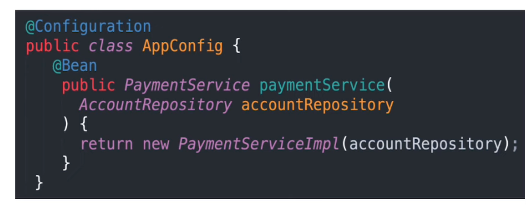
  * 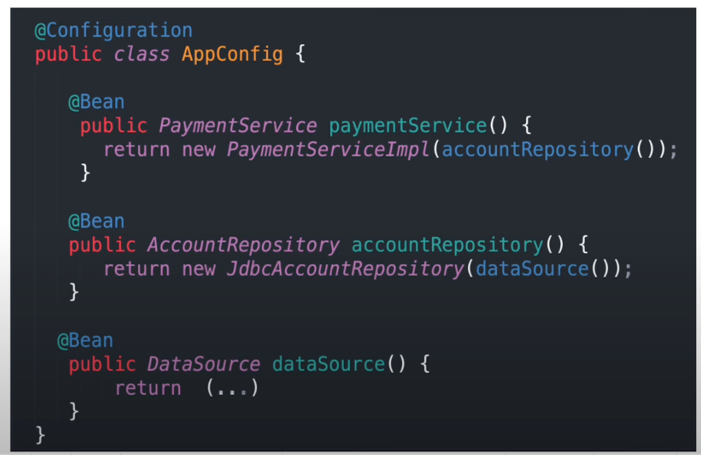
* Spring Component
  * @Component contains class-level annotation
  * Constructor dependency injection is automatically done using @Autowired (optional if there is only one constructor)
  * 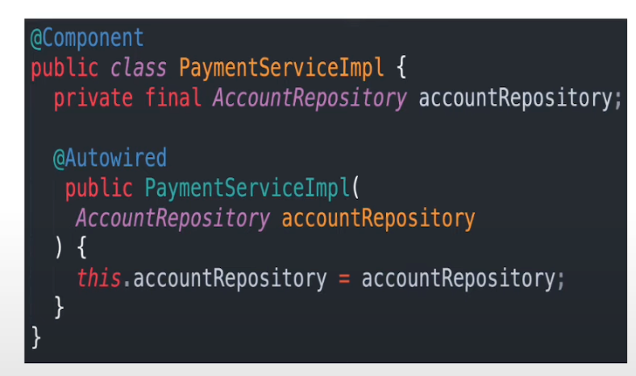
  * @Repository, @Service and @Controller as meta-annotation for @Component that allows to further refine components
* Bean Naming
  * 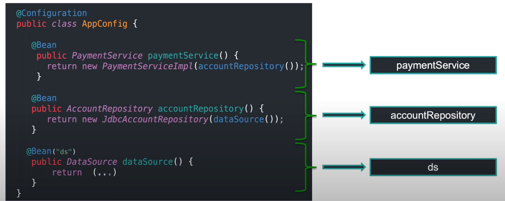
* Dependency Injection:
  * Constructor Injection
  * Field Injection
  * Configuration Methods
  * Setter Methods Injection
* Constructor Injection
  * 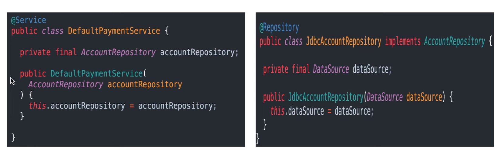
  * We can specify @Qualifier to tell Spring to select or prioritize if 2 beans are of same type
  * 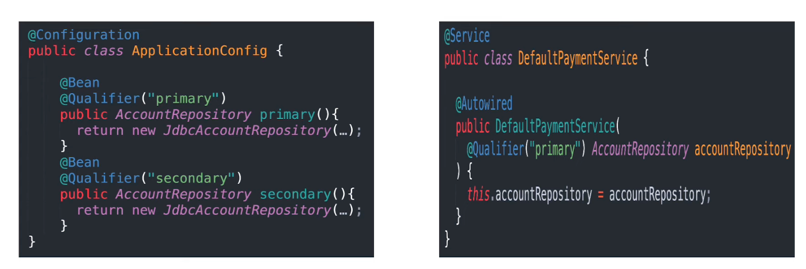
  * @Primary annotation can be used for this as well
  * 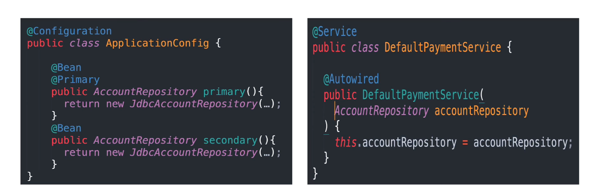
* Field Injection (Not recommended)
  * Direct injection as field without constructor or method declaration
  * 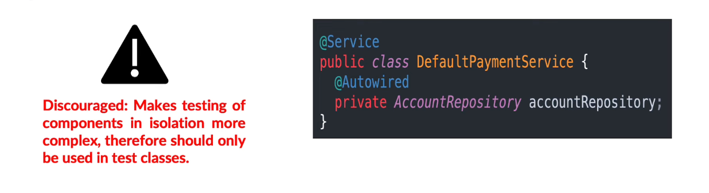
* Method Injections
  * One or many dependencies by one method
  * 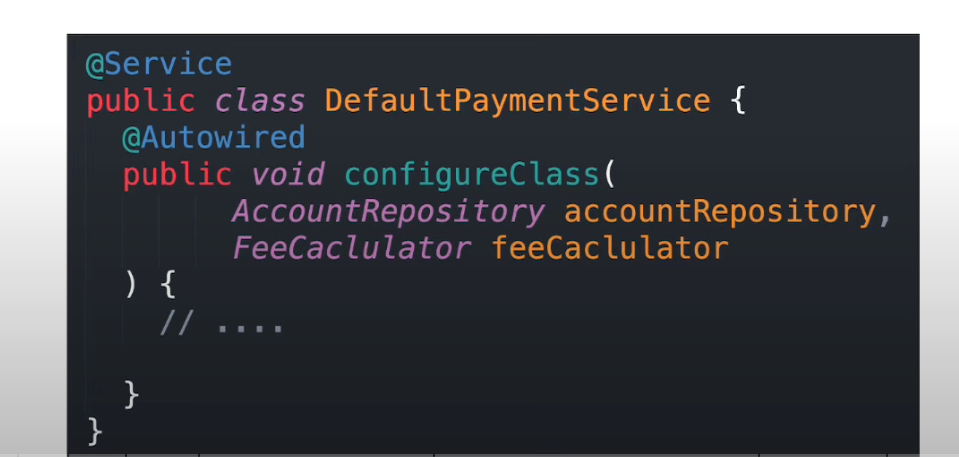
* Setter Injection
  * Using setter method injection
    * 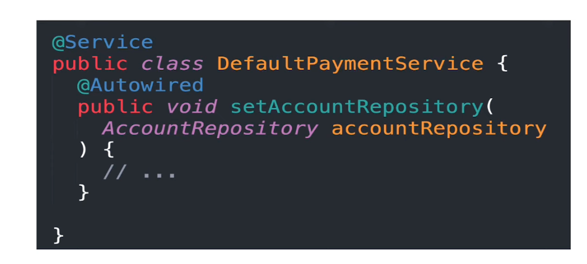

* Bean Scoping
  * Spring provides multiple scope
  * Default scope is "Singleton"
    * Singleton
    * Prototype
    * Request
    * Session
    * Application
    * Websocket
  * 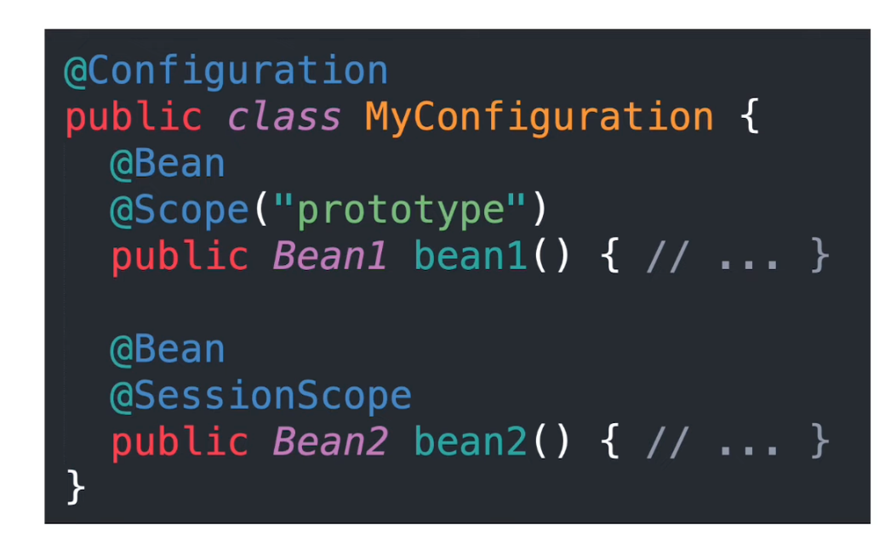
* Bean Environment
  * Environment Abstraction
  * Injectable
* Bean Profiles
  * 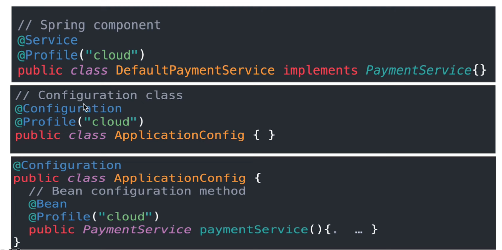
  * We can set profiles programmatically
  * 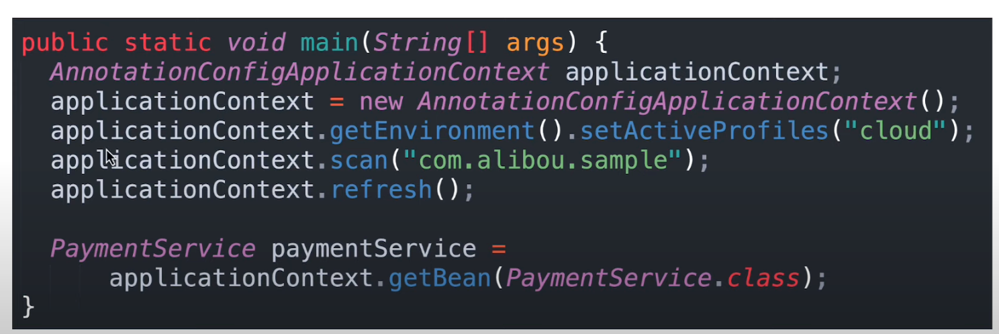
  * 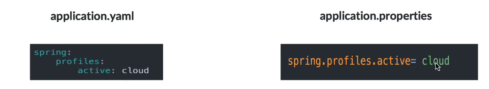
* @Value Annotation
  *  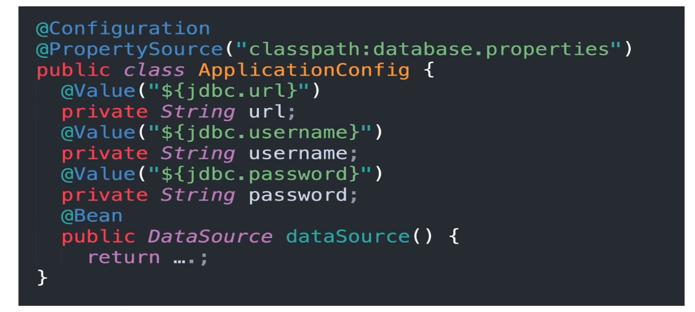
  *  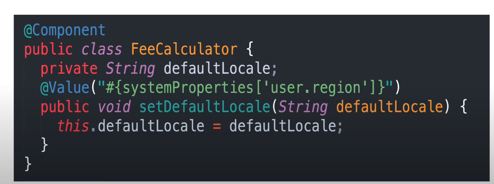

*  Spring Best Practices
  * Split configuration classes
  * Import Configuration
  * 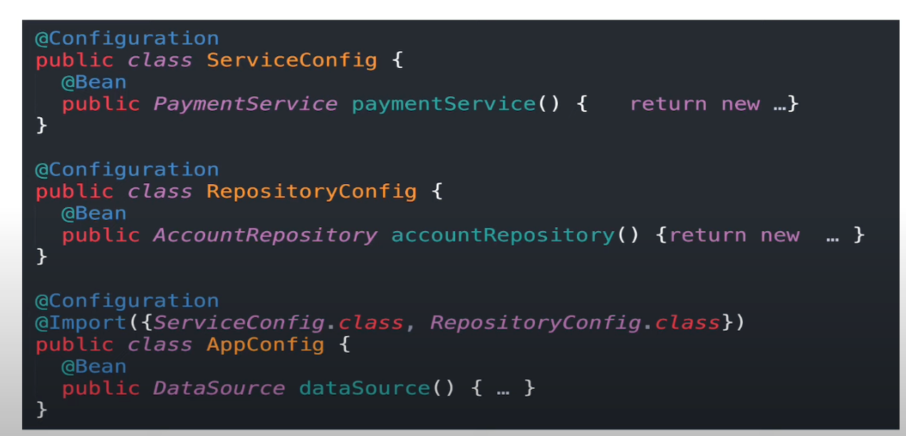

* Initialize Spring Projects from : https://start.spring.io/

* 