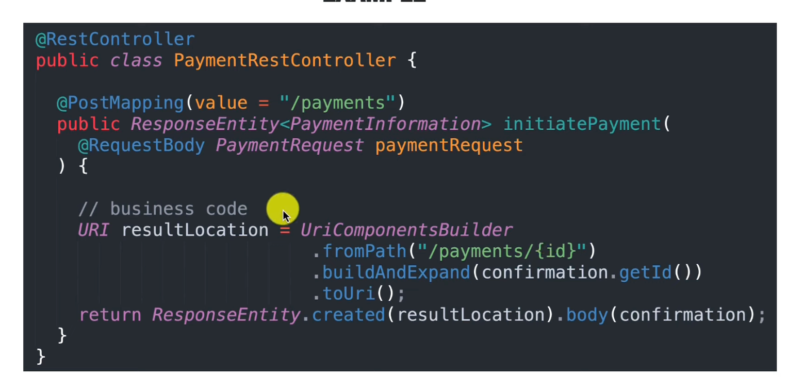
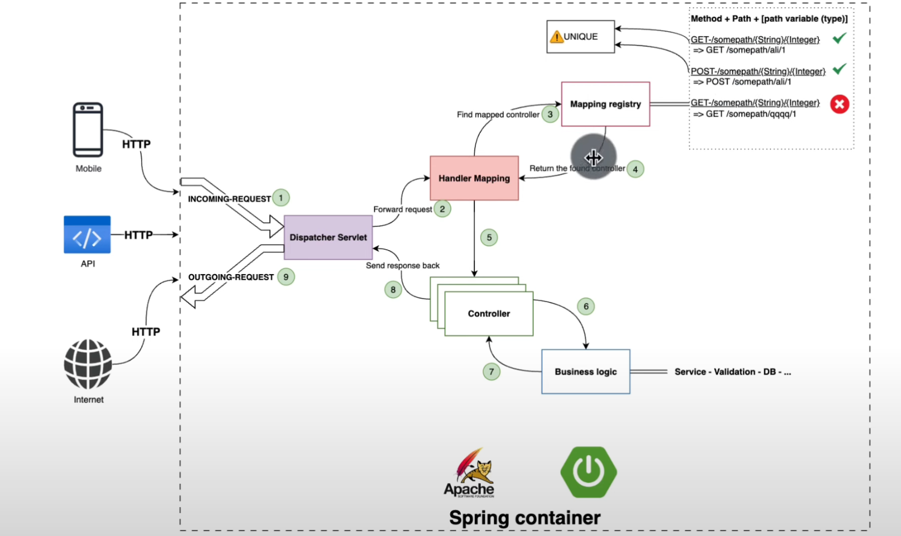
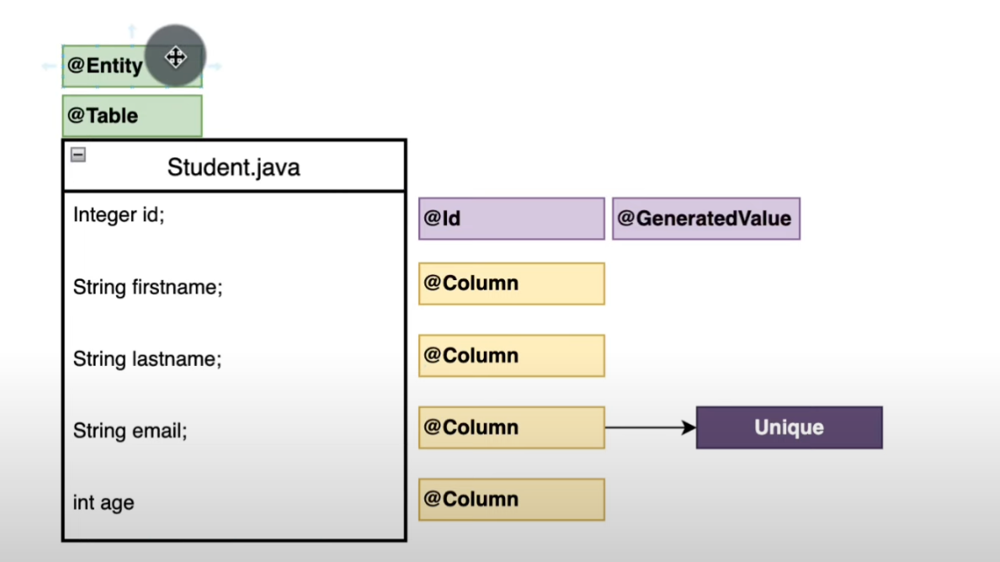
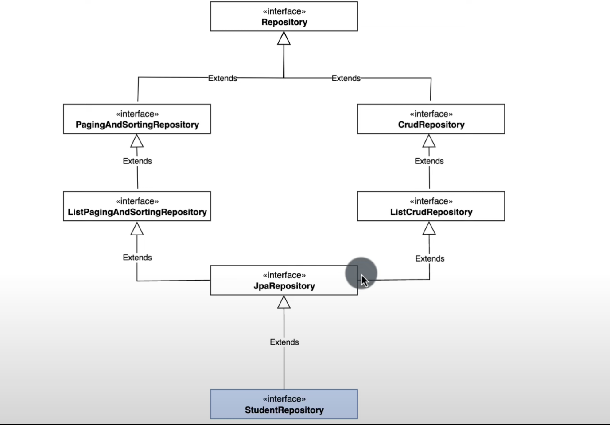
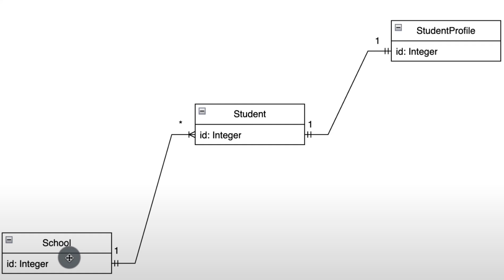
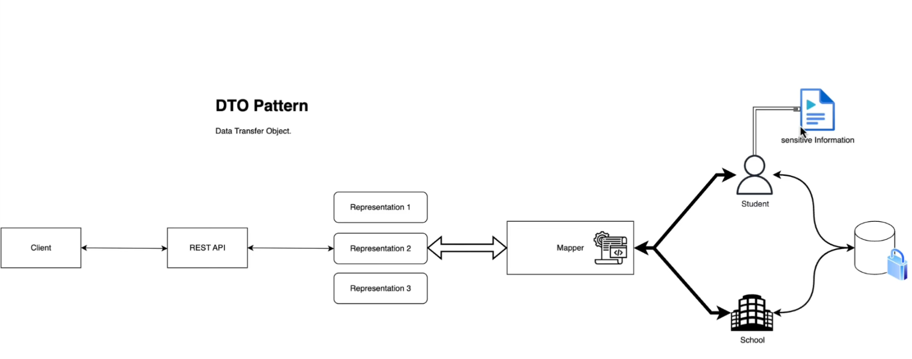

### Notes and Pointers

* Banner Generator: https://patorjk.com/software/taag/#p=display&f=Graffiti&t=Type%20Something%20

#### REST in SpringBoot
* 

#### Spring REST Controller Action

* 

#### Default docker command for postgres in local machine
* `docker run --name some-postgres -p 5432:5432 -e POSTGRES_PASSWORD=mysecretpassword -d postgres`

* Entity:
  * Represents a table in a database
  * 
* Spring Repo Interface Chain
  * 
* Entity relationship
  * 
* DTO Pattern
  * 